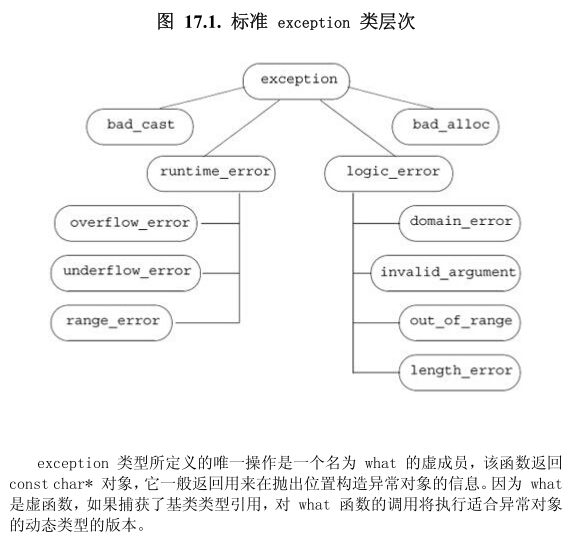

- [第十八章 **用于大型程序的工具**](#第十八章-用于大型程序的工具)
  - [18.1 **异常处理**](#181-异常处理)
    - [18.1.1 **抛出异常**](#1811-抛出异常)
      - [栈展开](#栈展开)
      - [栈展开过程中对象被自动销毁](#栈展开过程中对象被自动销毁)
      - [析构函数与异常](#析构函数与异常)
      - [异常对象](#异常对象)
    - [18.1.2 **捕获异常**](#1812-捕获异常)
      - [查找匹配的处理代码](#查找匹配的处理代码)
      - [重新抛出](#重新抛出)
      - [捕获所有异常的处理代码](#捕获所有异常的处理代码)
    - [18.1.3 **函数try语句块与构造函数**](#1813-函数try语句块与构造函数)
    - [18.1.4 **noexcept异常说明**](#1814-noexcept异常说明)
      - [违反异常说明](#违反异常说明)
      - [异常说明实参](#异常说明实参)
      - [noexcept运算符](#noexcept运算符)
      - [异常说明与指针、虚函数和拷贝控制](#异常说明与指针虚函数和拷贝控制)
    - [18.1.5 **异常类层次**](#1815-异常类层次)
  - [18.2 **命名空间**](#182-命名空间)
    - [18.2.1 **命名空间定义**](#1821-命名空间定义)
      - [每个命名空间都是一个作用域](#每个命名空间都是一个作用域)
      - [命名空间可以是不连续的](#命名空间可以是不连续的)
      - [定义命名空间成员](#定义命名空间成员)
      - [模板特例化](#模板特例化)
      - [全局命名空间](#全局命名空间)
      - [嵌套的命名空间](#嵌套的命名空间)
      - [内联命名空间](#内联命名空间)
      - [未命名的命名空间](#未命名的命名空间)
    - [18.2.2 **使用命名空间成员**](#1822-使用命名空间成员)
      - [命名空间的别名](#命名空间的别名)
      - [using声明：扼要概述](#using声明扼要概述)
      - [using指示](#using指示)
      - [头文件与using声明或指示](#头文件与using声明或指示)
    - [18.2.3 类、**命名空间与作用域**](#1823-类命名空间与作用域)
      - [实参相关的查找与类类型形参](#实参相关的查找与类类型形参)
      - [查找与std::move 和 std::forward](#查找与stdmove-和-stdforward)
      - [友元声明与实参相关的查找](#友元声明与实参相关的查找)
    - [18.2.4 **重载与命名空间**](#1824-重载与命名空间)
      - [与实参相关的查找与重载](#与实参相关的查找与重载)
      - [重载与using声明](#重载与using声明)
      - [重载与using指示](#重载与using指示)
      - [跨越多个using指示的重载](#跨越多个using指示的重载)
  - [18.3 **多重继承与虚继承**](#183-多重继承与虚继承)

---

---


# 第十八章 **用于大型程序的工具**
## 18.1 **异常处理**
异常处理机制允许程序中独立开发的部分能够在运行时就出现的问题进行通信并作出相应的处理。

### 18.1.1 **抛出异常**
C++中通过 **抛出（throwing）** 一条表达式   **引发（raised**一个异常  被抛出的表达式的类型以及当前的调用链共同决定了 **处理代码（handler）**

#### 栈展开
抛出异常后，如果throw在一个try语句块内时，检查与try关联的catch子句，如果找了就使用其处理异常；如果没找到且该try嵌套的其他try中，则在外层try匹配的子句，以此类推，沿着嵌套函数调用链不断查找，直至找到或是没找到，则退出主函数后过程终止

 - 找到catch子句后，执行catch中代码然后从与所在try块关联的最后一个catch子句之后的点继续执行。
 - 没找到，则程序调用标准库函数terminate终止程序

#### 栈展开过程中对象被自动销毁
栈展开过程中退出了某个块，编译器将负责确保在这个块中创建的对象能被正确的销毁

#### 析构函数与异常
使用类来控制资源的分配，能够确保无论函数正常结束还是遭遇异常，资源都能被正确释放。

所有标准库类型都能够确保它们的析构函数不会引发异常

#### 异常对象
异常对象是一种特殊的对象，编译器使用异常抛出表达式来对异常对象进行拷贝初始化。

### 18.1.2 **捕获异常**
通常情况下，如果catch接收的异常与某个继承体系有关，那么最好将其的参数定义为引用类型
#### 查找匹配的处理代码
catch语句按照其出现的顺序逐一进行匹配，越是专门的catch越应该置于整个catch的前端，如果多个catch的语句存在继承关系，则我们应该把继承的最低端的类放前面，将继承链的最顶端的类放在后面。
#### 重新抛出
一条catch语句通过重新抛出的操作将异常传递给另外一个catch语句，通过`throw;`语句，不包含任何表达式。
如果重新抛出前要改变异常内容，则需要异常声明是引用类型的。
#### 捕获所有异常的处理代码
使用省略号...作为异常声明，可以一次性捕获所有异常`catch(...)`,如果catch(...)与其他几个catch语句一起出现，则catch(...)必须在最后的位置。出现在捕获所有异常语句后面的catch语句将永远不会被执行

### 18.1.3 **函数try语句块与构造函数**
要想处理构造函数初始值抛出的异常，我们必须将构造函数写程函数try语句块（又称函数测试块）的形式。

try加在表示构造函数初始值列表的冒号以及表示构造函数体的花括号之前，这样与这个try关联的catch**既可以处理构造函数体抛出的异常，也可以处理成员初始化列表抛出的异常。**

### 18.1.4 **noexcept异常说明**
通过使用noexcept说明指定某个函数不会抛出异常，跟在函数参数列表后面。

必须出现在指定函数的所有声明语句和定义语句中

在成员函数中，noexcept出现在const及引用限定符之后，在final、override、=0之前
#### 违反异常说明
一旦一个noexcept函数抛出了异常，程序会调用terminate确保遵守不在运行时抛出异常的承诺。

因此noexcept可以在两种情况下使用：
 - 确认函数不会抛出异常
 - 我们根本不知道如何处理异常

#### 异常说明实参
noexcept接受一个可选实参，bool类型，如果实参是true，则函数不会抛出异常；如果是false，则函数可能抛出异常

#### noexcept运算符
noexcept说明符的实参常常与noexcept运算符会和使用，noexcept运算符是一个一元运算符，它的返回值是一个bool类型的右值常量表达式，用于表示给定的表达式是否会抛出异常。

#### 异常说明与指针、虚函数和拷贝控制
函数指针以及该指针所指的函数必须具有一致的异常说明

如果虚函数承诺不会抛出异常，则后续派生出来的虚函数也必须做出同样的承诺

当编译器合成拷贝控制成员时，也会生出异常说明，如果所有成员和基类的所有操作承诺了不会抛出异常，则合成的成员时noexcept的。

### 18.1.5 **异常类层次**

我们可以编写代码继承异常类来适合我们自己的程序

---

---

## 18.2 **命名空间**
多个库将名字放在全局命名空间中将会引发**命名空间污染**

**命名空间**为防止名字冲突提供了更加可控的机制，命名空间分割了全局命名空间，其中每个命名空间是一个作用域。
### 18.2.1 **命名空间定义**

```cpp
namespace nsp {
  /*xxxxxx*/
}   //没有分号
```
命名空间可以嵌套定义

#### 每个命名空间都是一个作用域
命名空间中的名字必须唯一，但不同命名空间可以有相同名字成员，命名空间中的名字可以被该命名空间中的其他成员访问，也可以被内嵌作用域的任何单位访问

位于命名空间之外的代码必须指明所用名字所属命名空间。
#### 命名空间可以是不连续的
```namespace nsp{/*  */}```可能是定义了一个名字为nsp的新命名空间，也可能是为已经存在的命名空间添加一些新的成员

这种不连续性可以让我们将几个独立的接口和实现文件组成一个命名空间，命名空间的一部分用于定义类以及声明作为类接口的函数及对象，这些成员应该放在头文件中； 命名空间成员的定义部分则置于另外的源文件中

通常情况，不把`#include`放在命名空间内部，如果我们这么做了，隐含的意思是把头文件中所有的名字定义成该命名空间的成员。

#### 定义命名空间成员
命名空间对于名字的声明必须在作用域内，同时该名字的定义需要明确指出其所属的命名空间，而且定义必须出现在所属命名空间的外层空间中。
#### 模板特例化
模板特例化必须定义在原始模板所属的命名空间中，只要我们在命名空间中声明了特例化，就能在命名空间外部定义。

#### 全局命名空间
定义在所有类、函数、命名空间外的名字就是定义在**全局命名空间**，全局命名空间以隐式的方式声明，并且在所有程序中都存在。全局作用域中定义的名字被隐式地添加到全局命名空间中。

```cpp
//表示全局命名空间中的一个成员，全局命名空间没有名字
::member
```

#### 嵌套的命名空间
嵌套的命名空间是指定义在其他命名空间中的命名空间。

内层命名空间声明的名字将隐藏外层命名空间的同名成员。
#### 内联命名空间
于普通嵌套命名空间不同，内联命名空间中的名字可以被外层命名空间直接使用
```cpp
inline namespace nsp {
  /*xxxxxx*/
}   //没有分号
```
关键字inline必须出现在命名空间第一次定义的地方，后续再打开的时候可以写inline也可以不写。

#### 未命名的命名空间
`namespace{/**/}`没有名字，namespace紧跟花括号，未命名空间中定义的变量拥有静态生命周期：第一次使用前创建，程序结束才销毁。

一个未命名的命名空间可以在某个给定的文件内不连续，但是不能跨越多个文件。

每个文件定义自己的未命名的命名空间，如果两个文件都含有，那么两个空间无关，可以定义相同的名字，是不同实体。如果头文件中定义了未命名的命名空间，则该命名空间中定义的名字将在每个包含了该头文件的文件中对应不同实体。

定义在未命名的命名空间中的名字可以直接使用。

未命名的命名空间中的名字的作用域与该命名空间所在的作用于相同。

未命名的命名空间取代文件中的静态声明

### 18.2.2 **使用命名空间成员**
#### 命名空间的别名
`namespace primer = cplusplusprimer;`

命名空间的别名也可以指向一个嵌套的命名空间

一个命名空间可以有多个同义词或别名，都与原名等价。
#### using声明：扼要概述
一条using声明语句一次只引入命名空间的一个成员。

using声明引入的名字遵守作用域规则：它的有效范围从using声明的地方开始，一直到using声明所在的作用域结束为止。

#### using指示
using namespace 命名空间名字

作用域从using声明的地方开始，一直到using声明所在的作用域结束为止。

using指示具有将命名空间成员提升到包含命名空间本身和using指示的最近作用域的能力，个人理解： 意思就是好像using指示的命名空间中的东西都被添加到了当前的命名空间，容易产生冲突

#### 头文件与using声明或指示
头文件顶层作用域中含有using指示或声明，会将名字注入到所有包含了该头文件的文件中。头文件最多只能在它的函数或命名空间内使用using指示或using声明

避免使用using指示，可能造成命名空间污染，using指示并非一无是处，在命名空间本身的实现文件中可以使用using指示。

### 18.2.3 类、**命名空间与作用域**
命名空间内部名字的查找遵循常规的查找规则：由内向外依次查找每个外层作用域，直到最外层的全局命名空间查找过程终止。只有位于开放的块中且在使用点之前声明的名字才被考虑。

除了类内部出现的成员函数定义之外，总是向上查找作用域。

可以从函数的限定名推断出查找名字时检查作用域的次序，限定名以相反次序指出被查找的作用域。```A::V::f2```先在f2中，再从v，再从A。

#### 实参相关的查找与类类型形参
当我们给函数传递一个类类型的对象时，除了在常规的作用域查找外还会查找实参类所属的命名空间。

查找规则的这个例外允许概念上作为类接口一部分的非成员函数无须单独的using生命就能被程序使用。
#### 查找与std::move 和 std::forward
因为这两个模板函数执行比较特殊的操作，名字冲突比较高，因此使用其显式限定版本。
#### 友元声明与实参相关的查找
一个另外的未声明的类或函数如果第一次出现在友元声明中，则认为它是出现在最近的外层命名空间中的成员。
### 18.2.4 **重载与命名空间**
#### 与实参相关的查找与重载
对于接受类类型的实参的函数来说，其名字查找将在实参类所属的命名空间中进行。同样，对于选定候选函数集来说，我们将在每个实参类（以及实参类的基类）所属的命名空间中搜寻候选函数。
#### 重载与using声明
using声明语句声明的是一个名字，而非一个特定的函数。

我们为函数书写using声明时候，该函数的所有版本都被引入到当前作用域中。

引入一个与已有函数形参列表完全相同的函数将引发错误

#### 重载与using指示
using指示将命名空间的成员提升到外层作用域中，如果命名空间的某个函数与该命名空间所属作用域的函数同名，则命名空间的函数将被添加到重载集合中。

对于using指示来说，引入一个与已有函数形参列表完全相同的函数不会引发错误，只要我们知名调用的版本即可。

#### 跨越多个using指示的重载
如果存在多个using指示，则来自每个命名空间的名字都会成为候选函数集的一部分

## 18.3 **多重继承与虚继承**
