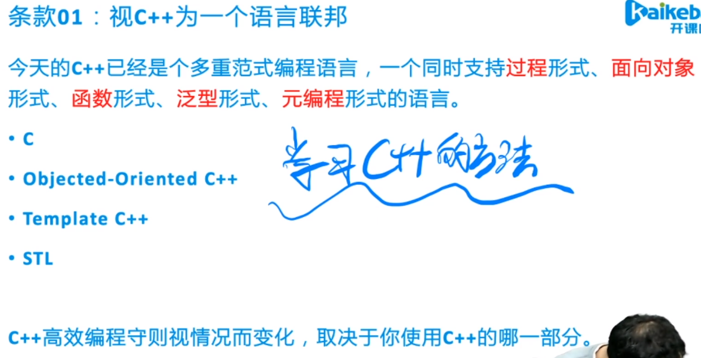
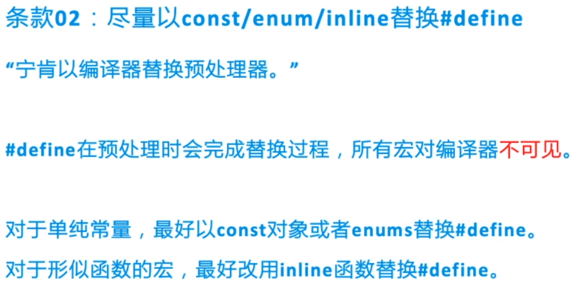
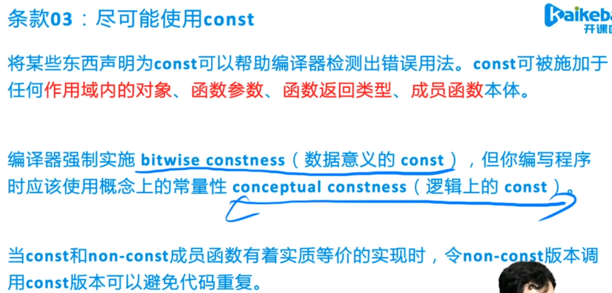
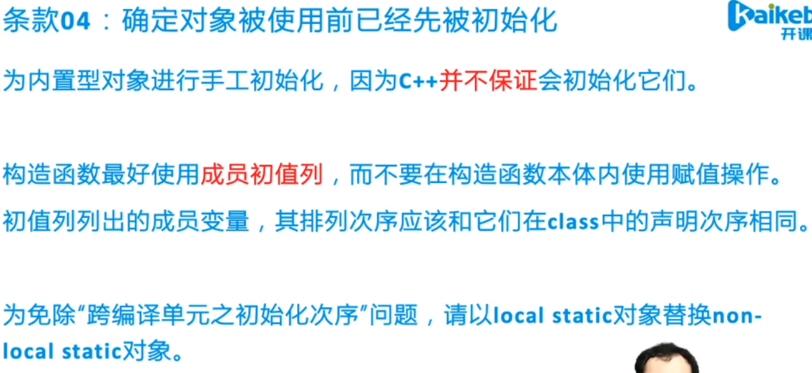

# Charpter 1:  Accustoming yourself to C++

---

[toc]

## Item 1: View C++ as a federation of languages


- there are four sublanguages: 
  - C : blocks, statements, preprocessor, built-in data type, arrays, pointers ...
  - Objected-Oriented C++ : classes, encapsulation, inheritance, polymorphism, virtual ...
  - Template C++ : This is the generic programming part. 
  - STL : containers, iterators, algrithms, function objects...
- for different sublanguages, the effective programming requires maybe changed, don't be surprised.
> **REMEMBER**: Rules for effective C++ programming vary depending on the part you are using.

## Item 2: Prefer const, enum and inline to #define


调试工具依赖编译器：例如g++ 加上-g 会将相关代码编译到程序中去，出错时候能够定位错误的语句，一旦使用宏，他展开了，很难发现BUG

- It can be also called "prefer the complier to the processor" , because the #define​ maybe treated as if it's not part of the language.
```cpp
/*BAD*/
//when use this:
#define ASPECT_RATIO 1.23
//when use it but get an error during compilation, you may  get error message about 1.23 rather ASPECT_RATIO. if it's not define in local file ,you maybe confused about that.

/*GOOD*/
//solution is to replace the macro with constant.
const double AspectRatio = 1.23;
//it will enter the symbol table.
```
### two sepcial cases:
> 1.define constant pointers. Usually constant definitons are put in header files. 
```cpp
const char* const author_name = "Mengbw_";
//it's more better to use :
const std:string author_name("Mengbw_");
```
> 2.class-specific constant, we need to make it a member of the class to limit the scope of a constant. Besides, make it a static to ensure existing at most one copy of the constant.  
```cpp
class GamePlayer {
 private:
  static const int n = 5; //const declaration not definition. for integral type can only have declaration if not get it's address
  int score[n];
  ...
}
const int GamePlayer:: n; //definition . put it in an implementation file not a header file.

//OR

class GamePlayer {
 private:
  static const double n; //const declaration not definition

  ...
}
const double GamePlayer:: n = 3;

//if compiler frobid to use static integral class constants for initial values for in-class specification, use enum
class GamePlayer {
 private:
  static const int n = 5; //if not support
  enum { n = 5 };         //you can use enum
  int score[n];
  ...
}
const int GamePlayer:: n;
```
- misuse #define to implement macro that look like functions to reduce overhead of function call
```cpp
/*BAD BAD BAD */
#define CALL(a, b) f(((a > b) ? a : b))  // parenthesize all the arguments in the macro body

/*GOOD GOOD GOOD*/
template <typename T>
inline void call(const T& a, const T& b) {
  f(a > b ? a : b);
}

//inline function obeys scope and access rules but macro can't in general.
```

> **REMEMBER**: 
> - for simple constants, prefer const objects or enums to #define
> - for function-like macro, prefer inline function to #define.

## Item 3: Use const whenever possible.


数据意义的const：`const int a = 1;` (很难实现真正意义上的const，可以通过地址修改)

逻辑意义的const：

```c++
class A {
  A() :y(0) { x = 1234; }
  void say1() const {   //表示函数内不会修改对象的成员属性
    cout << x << endl;
    y += 1;
  }  
  void say2() {}        //非const可以修改
  int x;
  mutable int y;
};
```

> 对于上边的代码，say1()定义为const的目的是为了让编译器监视我们的代码，say1()内部不能够修改对象的成员属性。
>
> 但是：另一个合理需求，希望知道say1()函数调用了多少次，就在函数里面修改一个记录值y，需要将y改成mutable
>
> 因此被称为逻辑上的const，只关注const的东西，有可能部分成员属性改变了，但是改变的部分对用户不重要，因此成为逻辑上的const


- for pointer, if the word const appears to the left of the asterisk(*), the pointed object is constant; if appears to the right, the pointer itself is constant. (who is constant: left value right pointer)
```cpp
const Widget* pw;
Widget const * pw;  //both is ok
```
STL iterators are modeled on pointers, an iterator acts much like T* point
```cpp
//iterator like : T* const
const std::vector<int>::iterator iter = vec.begin();
*iter = 12 ;// Right
++iter; // Error

// like : const T*
std::vector<int>::const_iterator cIter = vec.begin();
cIter = 3; //Error
++cIter; //Right
```
### const Member Funcion
- WHY : make member function can be used for const objects and know which interface can be modified. 
- if two functions are different in constness , they can be overload.
```cpp
const char& operator[](size_t p) const {...}
char& operator[](size_t p) {...}
```
in const member function, you can't modify member , otherwise you make the member value **mutable**
```cpp
class T {
  public:
    int length() const;
  private:
    mutable int e;  // e can be modified in lenght() 
}
```
### avoid duplication in const and non-const Member function
use non-const function call const funtion. 
but it's wrong use const call non-const because it might be modify something.

```cpp
//you need to add const first and then remove the const.
const char& operator[](size_t p) const {...}
char& operator[](size_t p) {
  return const_cast<char&> (   //remove const
    static_cast<const T&>(*this)[p] // make *this to const
  );
}
```
> **REMEMBER**: 
> 1. Declaring something const helps compilers detect errors.
> 2. compilers enforce bitwise constness. it mean you can not modify member variable in a const member function otherwise you make the variable mutable
> 3. if const and non-const member have same implementations, code duplication can be avoid by having non-const call const version.

## Item 4: Make sure initial objects before use them.



> 第三句话的意思：如果有两个文件，A文件中有个局部变量a， B中有个局部变量b，但是A中的a需要用B中的b初始化，因此尽量将b放到A文件中，因为难以保证B中的b先初始化，再初始化a


```c++
class A {
  A() : { x = 1234; y  = 0; } //使用是赋值运算符
  A() : x(1234), y(0) {}   //更好,使用是调用函数，同时初始化顺序与声明顺序一样
  A() : y(1234), x(0) {}   //初始化顺序依旧是先初始化x，后初始化y
  A() : x(1234), y(x+1) {} //先初始化x，x 是1234， y是1235
  A() : y(1234), x(y+1) {} //先初始化x，y还没有初始化，因此x是未知的
  int x;
  int y;
};
```

- In the C part of C++(see Item 1), it's not guaranteed to initialize. But It's constrast in the non-C part.
- The best way to do is to always initialize objects before using them.
- When initializing objects, it's better to initial them in order.
- If there are too many objects need to be initialized, you can use assignments and make it a private function usually.

```cpp
class FileSystem {...}
FileSystem& tfs() {
  static FileSystem fs;  /// declare and initialize a local static object.
  return fs;
}
```
> **REMENBER**:
> 1. Initialize objects of built-in type
> 2. Use member initialization list rather than assignment and in the same order they declared.
> 3. Replacing non-local static objects with local static objects.